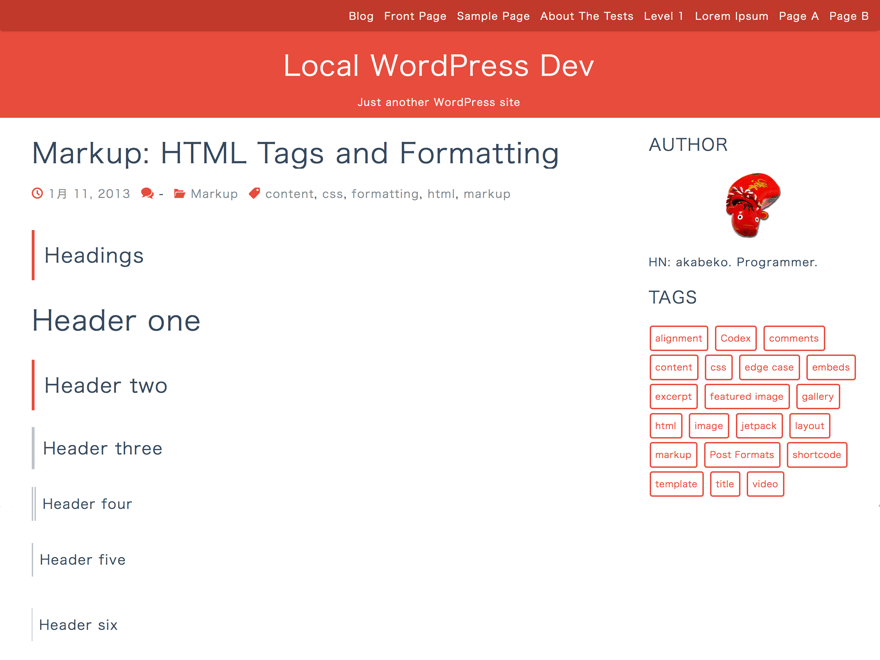

# minimalflat2

WordPress theme for [http://akabeko.me/blog](http://akabeko.me/blog)

## Installation

How to install the theme is as follows.

1. Download a zip file from [releases](https://github.com/akabekobeko/wp-theme-minimalflat2/releases)
2. Upload a zip file with WordPress theme setteings

## Build

1. Install [Node.js](https://nodejs.org/)
2. `git clone https://github.com/akabekobeko/wp-theme-minimalflat2.git`
3. `cd wp-theme-minimalflat2`
4. `npm start` or `npm run release`

## License

GNU General Public License v2 or later.  
[http://www.gnu.org/licenses/gpl-2.0.html](http://www.gnu.org/licenses/gpl-2.0.html)
